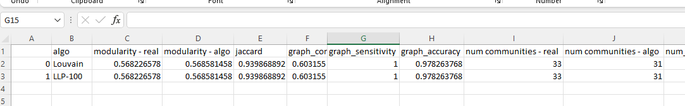
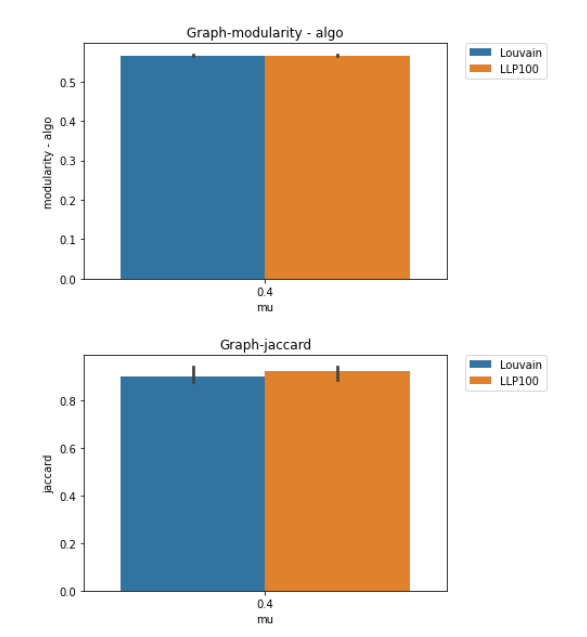

## Motivation

This project is as part as a workshop in [Analysis of Biological Networks](http://www.cs.tau.ac.il/~roded/courses/bnet21.html), instructed by Prof. Roded Sharan and Shani Jacobson.    
The workshop aims to improve existing algorithms for community detection in networks.

## Contents

- [Motivation](#motivation)
- [Installation](#installation)
- [How to use](#how-to-use)
  * [Quick start](#quick-start)
  * [Adding Run configurations](#adding-run-configurations)
  * [Output folder and visualization notebook](#output-folder-and-visualization-notebook)
- [Algorithms Description](#algorithms-description)
  * [The idea](#the-idea)
  * [Algorithms implemented with the idea](#algorithms-implemented-with-the-idea)
    + [Louvain](#louvain)
    + [Newman](#newman)
- [References](#references)

<small><i><a href='http://ecotrust-canada.github.io/markdown-toc/'>Table of contents generated with markdown-toc</a></i></small>


## Installation

1. Clone the repository
   ```bash
   $ git clone https://github.com/keskim1111/network-analysis.git
   ```
2. Make sure to have a C compiler on your computer and run:
    ```bash
    cd algorithms/newman_lp_critical
    make
    cd algorithms/newman_split
    make
    ```

3. Download [Gurobi][1] to your machine 
4. Install packages from the requirements file
## How to use

### Input format

We expect the single graph path to include two files with the following  formats:

- communities.dat 
  ```
  1 0
  2 0
  3 0
  4 1
  5 1
  6 1
  ```
- network.dat 
  ```
  1 2
  2 3
  1 3
  4 5
  4 6 
  5 6
  ```

We expect the multiple graph path to include folders in the single graph format.

You can use example graphs from the `graphs` folder:
- Benchmark  (Yeast and Arabidopsis)
- Shani_graphs (folder of 1,000 or 10,000 nodes graphs created with different mixing parameter )
### Quick start

```python
from api import kesty_one_graph, kesty_multiple_graphs
from pprint import pprint

## for single graph
graph_path = "graphs/Shani_graphs/1000_0.4_0"
communities = kesty_one_graph(graph_path)
print(communities)
#               [
#               ['5','2','3','4'],
#               ['1','6','7','8'],
#                ],

## for multiple graphs
graphs_path = "graphs/Shani_graphs"
communities_dictionary = kesty_multiple_graphs(graphs_path)
pprint(communities_dictionary)
# {'1000_0.4_0': [
#               ['1','2','3','4'],
#               ['5','6','7','8'],
#                ],
# '1000_0.4_1': [
#               ['5','2','3','4'],
#               ['1','6','7','8'],
#                ],
# '1000_0.4_2: [
#               ['5','2','3','4','6','7','8'],
#               ['1'],
#                ],
#               }               

```

### Adding Run configurations
The run object determines different parameters of the algorithm run. The default parameters are described in the table below.
You can play with the run object arguments. Example:
````python
from api import kesty_one_graph
from flow import RunParamInfo

yeast_run_obj = RunParamInfo(
  algorithm="newman",
  network_file_name="edges.txt",
  community_file_name="clusters.txt"
)
graph_path = "graphs\\Benchmark\\Yeast"
communities = kesty_one_graph(graph_path, yeast_run_obj)

````
  
| argument     | values      | purpose  | default value|
| :------------ |   :---:       | :-------- | :-------- |
| `algorithm`        | `"louvain","newman"`         | The  algorithm chosen to run   |`"louvain"`|
| `split_method`         | `"mod_greedy","min_cut,"`<br />`"random","ilp_sub_graph"`<br />`"ilp_whole_graph","newman_whole_graph"`         | split method that will be used in louvain algorithm to split the mega nodes  |`"newman_whole_graph"`|
| `lp_list`         | list of ints         | lp values that the algorithm will run with   |`[100]`|
| `TimeLimit`         | number in seconds         | time limit for the ilp to run with   |`60*10`|
| `folder_name`         | string         | output folder name  |`""`|
| `max_mega_node_split_size`         | int         | relevant for "ilp_whole_graph" split method. limits the size to split   |`float("inf")`|
| `number_runs_original_louvain`    | int         | number of runs of louvain for comparison   |`1`|
| `community_file_name`         | string         | the file name to read communities from  |`community.dat`|
| `network_file_name`         | string        | the file name to read network from   |`network.dat`|
| `with_comparison_to_newman_louvain`   | `True,False`          | to run original algorithms for comparison   |`True`|
| `log_to_file`         | `True,False`         | log all logs to file  |True|
| `console_log_level`         | `"debug", "info", "warning", "error"`         | minimum log level to print to console  |`info`|

### Output folder and visualization notebook

After every run, an output folder is created in ``results\\full-flow`` with:

- log file of run
- a csv summarizing run information and evaluations scores (modularity, jaccard, concordance , accuracy, time and more):

  
- pickled df

You can use one of the last cells in the notebook at `visualization/create_bar_plots.ipynb` to visualize results with bar plots graphs.
for shanis file:
```python

# put here the name of the output folder
input_folder = "28-06-2022--12-00-14-del"
df = run_visu(input_folder)
create_bar_graphs(df,evals)
print_means(df, evals2)
print_times(df)
# display(df)
```
for yeast/arabadopsis file:
```python
#%%
# for yeast and arabdopsis
input_folder = "28-06-2022--15-18-23-yeast"
df = run_visu_benchmark(input_folder)
create_bar_graphs_benchmark(df,evals)
print_times(df)
# display(df)
```

and you will see:



## Algorithms Description


### The idea 
1. Run a known algorithm until ILP can run on current results (lp_critical) 
2. Run ILP on current results 
3. Add ILP results if ΔQ > 0

### Algorithms implemented with the idea
#### Louvain


#### Newman 


## References


[1] Newman, M. E. J. (2006). Modularity and community structure in networks. Proceedings of the National Academy of Sciences of the United States of America, 103(23), 8577–82. https://doi.org/10.1073/pnas.0601602103

[2]  Blondel, Vincent D; Guillaume, Jean-Loup; Lambiotte, Renaud; Lefebvre, Etienne (9 October 2008). "Fast unfolding of communities in large networks". Journal of Statistical Mechanics: Theory and Experiment. 2008  doi:[10.1088/1742-5468/2008/10/P10008](10.1088/1742-5468/2008/10/P10008)

[3] Evaluation of clustering algorithms for protein-protein 
interaction networks, Brohee & van Helden, BMC 
Bioinformatics, 2006

[1]: https://www.gurobi.com/documentation/9.5/quickstart_windows/software_installation_guid.html#section:Installation
